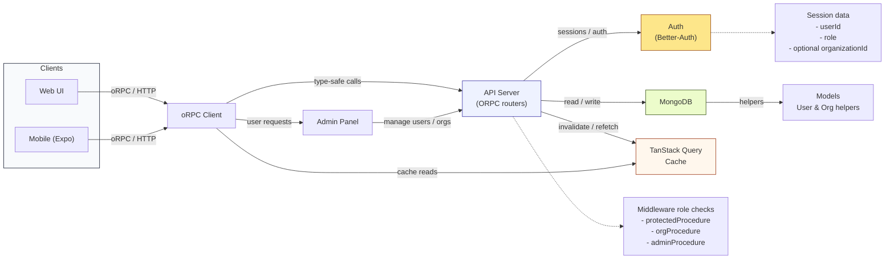

# Native Wind — RBAC App Template

A concise, user-friendly overview of the app: what it does, key features, the technology stacks that power it, and a simple architecture diagram (Mermaid). This README is written for product folks, designers, and general users who want a high-level picture.

---

## What this app does (short)

This template demonstrates Role-Based Access Control (RBAC) across a cross-platform app. It supports three roles:

- `user` — regular user features
- `org` — organization member (access to org data)
- `admin` — global administrator (manage organizations and users)

The app includes a polished UI that adapts based on the signed-in user's role, an Admin panel for organization/user management, and secure authentication.

---

## Key features (for non-technical audiences)

- Role-aware navigation: users only see screens and actions allowed for their role.
- Organization management: admins can create and edit organizations and assign users to them.
- User management: admins can view all users and change roles.
- Consistent user identity: profile links and user pages work reliably across the app.
- Cross-platform UI: mobile (Expo / React Native) and web with a consistent look-and-feel.

---

## Technology stack (short)

- Frontend: Expo (React Native) for mobile; React for web  
- Data fetching & caching: TanStack Query (React Query) on the client  
- API: ORPC (type-safe API surface) served by a lightweight server  
- Authentication: Better-Auth (session-based auth with MongoDB adapter)  
- Database: MongoDB (document store) with helper utilities  
- Monorepo tooling: pnpm

---

## Roles and what they can do (user-friendly)

- user
  - Default role for most users.
  - Use the application features available to individual users.

- org
  - Member of one organization.
  - Can access organization-only screens and view other org members.

- admin
  - Global administrator with the ability to:
    - Create, update, and delete organizations.
    - View all users and change their roles.
    - Assign or remove users from organizations.

---

## Simple architecture diagram

---

## Quick demo notes (for product / design reviewers)

- Ask a developer to sign you in as an `admin` user to see the Admin panel.
- As `admin` you can create organizations and assign users.
- Sign in as an `org` user to see organization-specific views and teammates.
- As a `user` you see only personal features.
